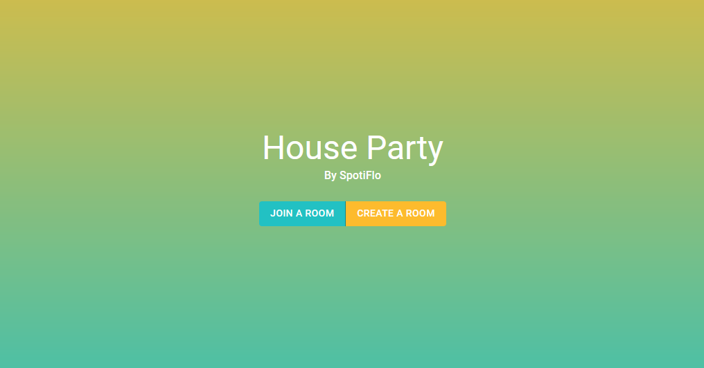
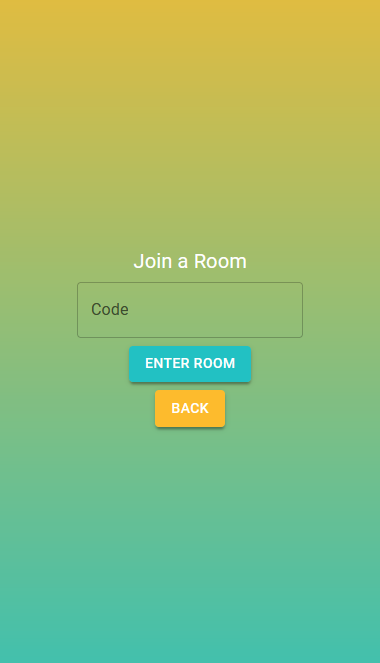
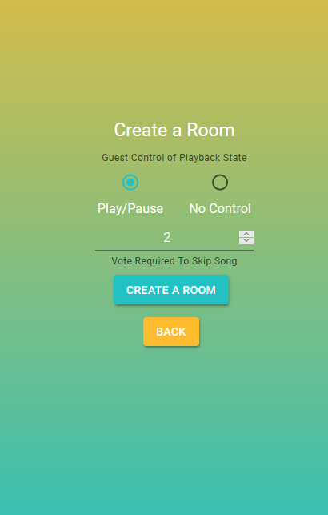
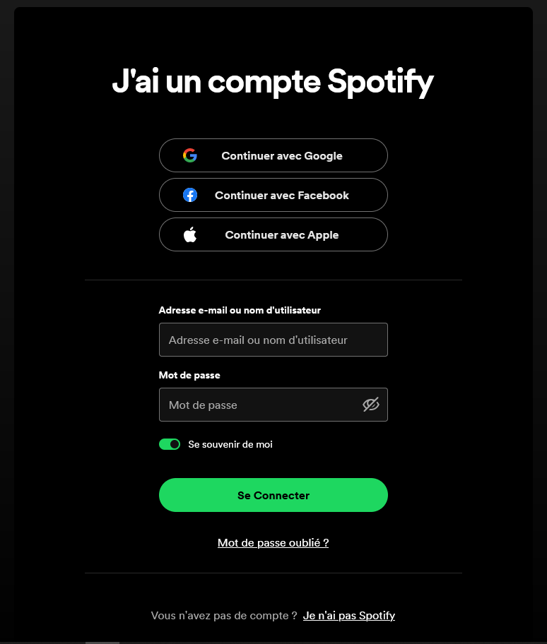
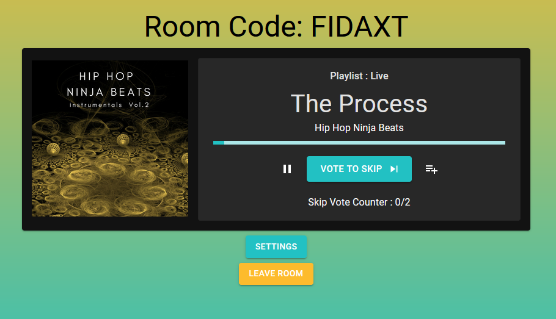
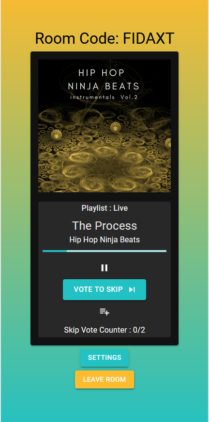
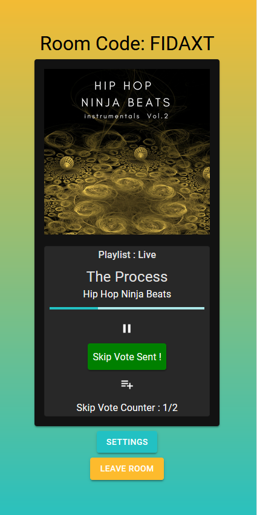
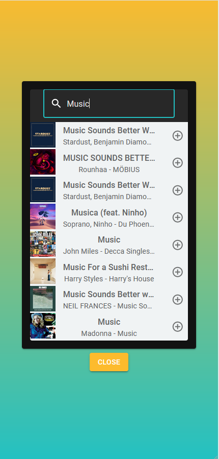

# PartyMix

PartyMix est une application web conçue pour dynamiser vos soirées. Elle permet aux invités d'ajouter des morceaux à la playlist Spotify de l'hôte et de voter pour passer à la prochaine chanson, offrant une expérience musicale collaborative et interactive.

## Fonctionnalités

- **Ajout de Musique** : Les invités peuvent ajouter leurs morceaux préférés à la playlist ou à la file d'attente Spotify directement depuis leur appareil.
- **Vote de Musique** : Permet aux invités de voter pour passer une chanson, assurant que la playlist reste dynamique et adaptée aux préférences de tous.
- **Contrôle de l'Hôte** : L'hôte conserve le contrôle final sur la playlist, avec la possibilité d'ajouter, de supprimer ou de réordonner les morceaux.

## Comment ça marche ?

1. **Connexion de l'Hôte** : L'hôte se connecte à son compte Spotify et crée une session PartyMix.
2. **Rejoindre la Session** : Les invités rejoignent la session en utilisant un code unique fourni par l'hôte.
3. **Interagir avec la Playlist** : Les invités ajoutent des morceaux et votent directement depuis leurs appareils.

## Technologies Utilisées

- **Frontend** : React.js
- **Backend** : Django, Django REST Framework
- **API** : Spotify Web API

## Preview

<table>
  <tr>
    <td>
      
    </td>
    <td>
      
    </td>
    <td>
      
    </td>

  </tr>
</table>
<table>
    <td>
      
    </td>
    <td>
      
    </td>
</table>
<table>
    <td>
      
    </td>
    <td>
      
    </td>
    <td>
      
    </td>
</table>
